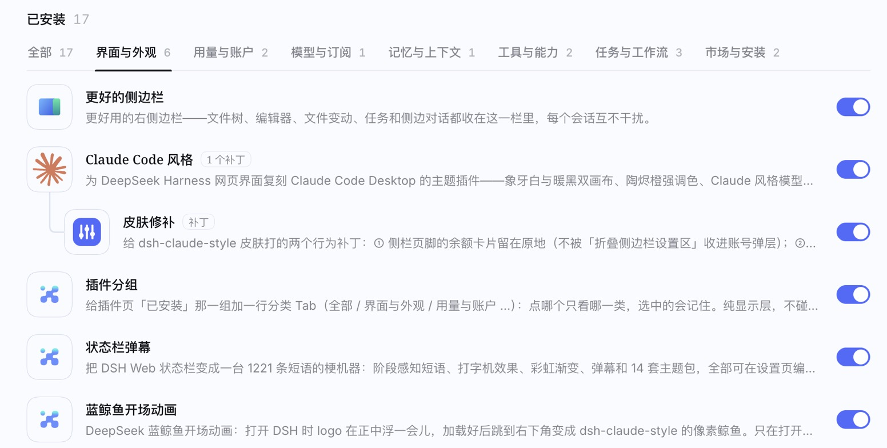

# dsh-plugin-groups

> [English](README.md) | **中文**

给 DeepSeek Harness 插件页「已安装」那一组加**一行分类 Tab**，并把**补丁插件挂在它修的那个插件下面**。




## 它做什么

- **分类 Tab**：`全部 · 界面与外观 · 用量与账户 · 模型与订阅 · 记忆与上下文 · 工具与能力 · 任务与工作流 · 市场与安装`。
  点哪个就只看哪一类；选中的那个记在浏览器里，下次打开还是它；计数随安装 / 卸载实时变。
  哪类都不沾的插件落「其他」，永远排最后。
- **补丁挂在父插件下面**：专门给另一个插件打补丁的插件，会挂在父插件卡片正下方：整张卡往右缩进一格，
  左边一条「└」细线连到父插件，名字后面一个「补丁」小标签；父插件名字后面标「N 个补丁」。
  补丁跟着父插件归类。父插件没装时，补丁照常单独显示、不缩进。
- **像官方自己画的**：Tab 的度量照抄官方设置页那行 Tab（`gap:22px`、13px/20px、2px 下划线、官方 focus ring），
  只用 DSH 的设计变量，浅色、深色、第三方皮肤下都自动跟着变。
- **纯显示层**：不注册槽位、不改配置、不写文件、不联网，不碰任何其他插件，也不碰 DSH 代码。关掉或卸载即回到原样。

## 安装

```sh
# 桌面版
dsh plugin --profile desktop add github:p56568833/dsh-plugin-groups
# 网页版
dsh plugin --profile web add github:p56568833/dsh-plugin-groups
```

装完完全退出 DeepSeek Harness 再打开（网页版重启 `dsh web` 后刷新页面）。

卸载：插件页里卸载，或 `dsh plugin --profile desktop remove dsh-plugin-groups`。

## 自己改

都在 `client.js` 顶部：

| 表 | 作用 |
|---|---|
| `CATEGORIES` | 数组顺序 = Tab 顺序。`packages` 是精确包名（优先），`keywords` 是给以后新装插件的包名兜底正则。按**包名**分类而不是按显示标题，因为标题会被汉化插件改写、还会跟界面语言变。 |
| `PARENTS` | `补丁包名 → 父插件包名`。用到别的补丁插件就往里加一行。自带的几对来自作者自己的环境，两边都装了才会显示：`dsh-skin-fixes`、`dsh-cn-greeting` → `dsh-claude-style`；`dsh-story-progress` → `dsh-story-turing`；`dsh-market-sidebar` → `dshmarket`。 |

Tab 名跟着页面自己的语言走：页头是「插件」用中文，是 "Plugins" 用英文。

## 原理

对着官方 `@deepseek-ai/dsh-client-ui-plugin-manager` 的页面结构：

| 钩子 | 用途 |
|---|---|
| `[data-plugin-panel]` | 插件页根节点 |
| `[data-plugin-group="bundles"] ul` | 「已安装」卡片列表（本身是 `flex-direction: column`） |
| `li[data-plugin-package="npm 包名"]` | 一张卡片 —— 官方自己也拿它做「滚动到某个插件」 |

Tab 行插在列表第一个子节点并带 `order:-1`；过滤是给卡片设 `display:none`；补丁挂载只设 flex 的 `order`
（不挪 DOM，顺序仍归 React）再打上 `data-dsh-pg-*` 标记交给 CSS 画。`MutationObserver` 在 React 重渲染后补回来，
并忽略自己造成的变更。DSH 升级后这些钩子要是没了，插件什么都不做，只在控制台留一条提醒。

排查：页面根 `<html>` 上的 `data-dsh-plugin-groups`（`idle` / `flat` / `active:N` / `broken` / `renamed`）和
`data-dsh-plugin-groups-tab`（当前 Tab）。选中的 Tab 存在 `localStorage["dsh-plugin-groups/tab.v1"]`。

## 验证

```sh
node verify.mjs
```

在假 DOM 里跑一遍 Tab 与补丁挂载的行为（切换、记忆、高亮兜底、幂等、卸载复原）；在装了桌面版的 macOS 上，
还会从 `app.asar` 里读官方插件管理页的源码，断言这些钩子都还在，并用反向用例证明这些断言真的会失败。

## 许可

[MIT](LICENSE)
